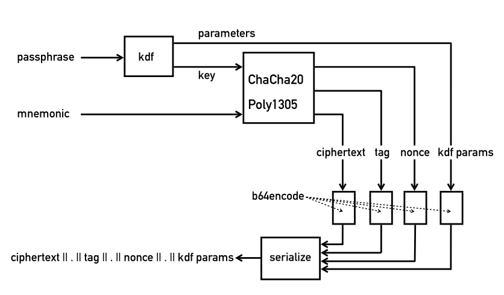

## Description
BipEncryptor is an [authenticated encryption](https://en.wikipedia.org/wiki/Authenticated_encryption) scheme for securing BIP32/39 cryptocurrency recovery phrases. Upon encrypting, the program will produce a serialized string composed of four base64-encoded values, separated by a period:
```
<ciphertext.mac.nonce.kdf_args>
```

The period-separated values are as follows:

1. The ciphertext obtained by encrypting the mnemonic phrase with ChaCha20
2. The MAC obtained through authenticating with Poly1305
3. The nonce value used with the ChaCha20 cipher
4. A semi-colon-separated list of arguments for the argon2 key derivation function

Before being encoded with base64, the last value looks something like this:
```
16;1183492;8
```

And refers to the following argon2 parameters:
1. The time cost
2. The memory usage in bytes
3. The number of virtual CPU cores used

Currently, BipEncryptor uses a time cost of 16, 75% of available memory, and every virtual core of the CPU. These parameters are __necessary for deriving the decryption key__.



### Cryptographic Primitives
This project is written in Python and uses the ```pycryptodome``` implementation of ChaCha20-Poly1305 for encryption and authentication. It uses the ```argon2-cffi``` package


### Encryption

```bash
$ ./bipencryptor.py -e "hospital blanket pottery close sheriff gate agree vintage truly antique arm radar" -k "th15is@secr3tp@ssphr@senob0dykn0wsbutm3"

$ qeSj8zF5vv1PfFYf71rD3VynYhCdvDZSyo3n5jOQmh655aNDGkkdq4dLHQfk8HzVHAahloHBxqNHpHa2ShynUWoXtsg3MO515dBeTCxUxhkm.8sg6KL1nIljKkeYUx+dIyA==.7fTMJkoJrUJ2ION9.MTY7MjQyNzM2NTs4
```


### Decryption

```bash
$ ./bipencryptor.py -d "qeSj8zF5vv1PfFYf71rD3VynYhCdvDZSyo3n5jOQmh655aNDGkkdq4dLHQfk8HzVHAahloHBxqNHpHa2ShynUWoXtsg3MO515dBeTCxUxhkm.8sg6KL1nIljKkeYUx+dIyA==.7fTMJkoJrUJ2ION9.MTY7MjQyNzM2NTs4" -k "th15is@secr3tp@ssphr@senob0dykn0wsbutm3"

$ hospital blanket pottery close sheriff gate agree vintage truly antique arm radar
```


### Disclaimer
Do not send funds to any cryptocurrency address associated with the aforementioned mnemonic phrase; they will be confiscated.
